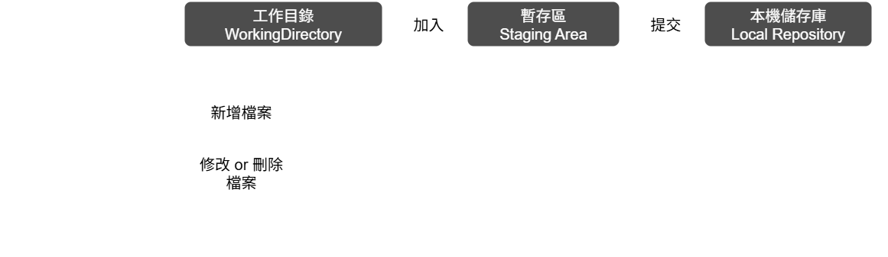

# 檔案狀態

git 追蹤變更裡，將開發從編輯到提交動作，區分三段檔案狀態：
|  | 動作 | 檔案狀態 |
| :-: | :-: | :-: |
| 1 | 編輯 | 工作目錄 WorkingDirectory |
| 2 | 加入 | 暫存區 Staging Area |
| 3 | 提交 | 儲存庫 Local Repository |

依據檔案追蹤情形，有以下意涵與情況：

## 未追蹤
- 未追蹤 (untracked)：git 辨識出未從被追蹤的檔案新增至此，該類檔案皆為此狀態。得加入暫存區之後才會開始追蹤 (屆時才會轉換狀態為 **已暫存**)。

## 追蹤中
- 已修改 (modified)：git 辨識出 **追蹤中的檔案有修改，但尚未加入暫存區**。
- 已暫存 (staged)：git 辨識出 **追蹤中的檔案已在暫存區準備提交**，包含兩種情形
    - 於工作目錄裡**未追蹤**，從 **未追蹤 轉 已暫存**。也是該檔案加入追蹤的第一版。
    - 於工作目錄裡**追蹤中**，從 **已修改 轉 已暫存**。已經提交過，現在要再次更新該檔案版本。
- 已提交 (committed)：表示檔案變更 (暫存區的變更) 已交付儲存庫，git 會記錄該歷史版本，後續以此狀態繼續追蹤檔案。
- 未修改 (unmodified)：git 辨識出 **該檔案與最後一個版本的狀態相同**，沒有任何修改。
> 在提交前，若有兩個相反且可抵銷的編輯操作，git 可能會辨識為 **未修改**。

| 檔案狀態轉換圖 |
| :-: |
|  |

# 基本操作指令

| 指令 | 作用 |
| :-: | :-: |
|  |  |
