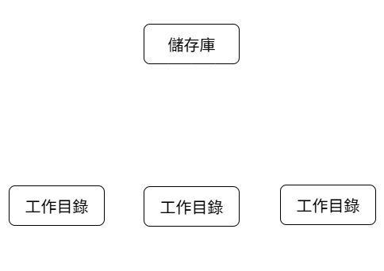
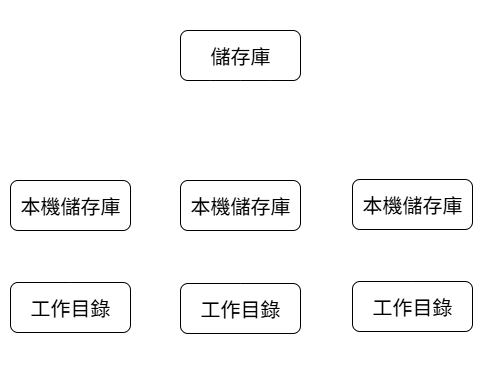

# 概念
## git

git 目的為追蹤專案下的檔案異動 (加入、刪除、修改)。

是一種版本控制系統 (Version Control System，VCS)，進一步分類，他屬於 **分散式** 版本控制系統 (Distributed Version Control System，DVCS)。

---

## 版本控制系統分類

分為兩類:
- **集中式** 版本控制系統 (Centralized Version Control System，CVCS)
- **分散式** 版本控制系統 (Distributed Version Control System，DVCS)

| 項目     | 集中式版本控制系統（Centralized VCS） | 分散式版本控制系統（Distributed VCS） |
| ------ | -------------------------- | -------------------------- |
| 結構     | 所有版本集中在中央伺服器               | 每個開發者有完整的版本庫               |
| 代表工具   | SVN、CVS                    | Git、Mercurial              |
| 網路需求   | 操作多需連線中央伺服器                | 大多數操作可離線進行，不時再更新同步             |
| 效能     | 操作需聯網               | 本地操作                  |
| 單點故障風險 | 伺服器掛掉可能失資料               | 每人都有備份                   |
| 架構圖 |                |                    |

---

## git / github

### Repo

    - Repository 簡稱，一個 儲存原始碼、版本歷史、設定與檔案的集合區 (可以指概括專案需求的資料夾)。
    
    - 可以指本地端的資料夾（local repo），也可以是 GitHub 上的遠端儲存庫（remote repo）。
    
    - 通常就是一個專案 (概括開發相關文件)。

### github

    官方提供放置 repo 的雲端平台，就是 github。提供跨平台桌面工具、網頁介面幫助小組協作專案開發。

> 兩者在核心功能上皆提供：
> - 變更追蹤
> - 分支管理

---

## 檢視當前版本

於平台下載後，可以到如命令提示字元 (CMD)、git bash 等指令平台，檢視當前版本:
``` 
git --version
```

---

## 全域設定

### 使用者名稱
``` 
git config --global user.name "名字 (英文優先)"
```

> 若有空格，建議改為底線 ( Li cy => Li_cy)

### 電子郵件
``` 
git config --global user.email "電子郵件"
```

### 預設主分支名稱
``` 
git config --global init.defaultBranch 名稱
```

> 預設名稱為 main，有的則是 master

### 檢視當前設定

    就是上述三個指令末段放空
``` 
git config --global user.name
```
```
git config --global user.email
```
```
git config --global init.defaultBranch
```

---
