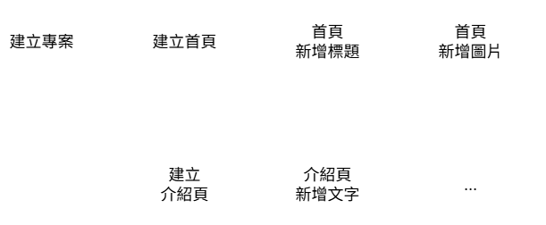

# 提交與分支
## 提交 (commit)

開發過程，等同 **一序列的功能新增和錯誤修正**。理想上開發會有 "階段"，將 **此次階段的變更"保存"到儲存庫的過程** ，就是 **提交 (commit)**。提供未來回復至當前 "階段"。
> git 每識別出一次變更，就可以進行一次 **提交**。因此 "階段" 的尺寸拿捏是主觀的，端看開發團隊共識。或者參考後續的 [git flow](https://github.com/Li732375/git_note/edit/main/note_2.md#git-flow)。

> 每次提交紀錄，是記在該次提交 "更新 / 變更後" 的專案狀態。

## 分支 (branch)

有時因為開發內容上彼此獨立，因此可以兩端並行開發，後續在合併即可。這時就可以從原先 "主分支" 切出 **分支 (branch)**，各端獨立作業，未來在行合併。

假設要開發網站首頁與介紹頁，
- 建立首頁 > 新增標題 > 新增圖片
- 建立介紹頁 > 新增文字

開發序列圖示：

|  | 單一序列 | 分支序列 |
| :-: | :-: | :-: |
| 階段序列圖 |  |  |
| 分支序列圖 |  |  |

> 分支可以再區分
> - 長期分支：在專案開發中都會存在的分支，如主分支。
> - 短期分支：因應短期功能新增或錯誤修正而暫時延伸的分支，合併後就會刪除該分支。

## git flow
