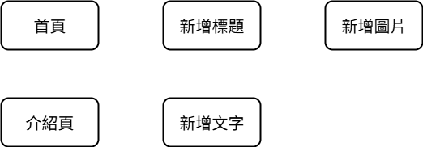
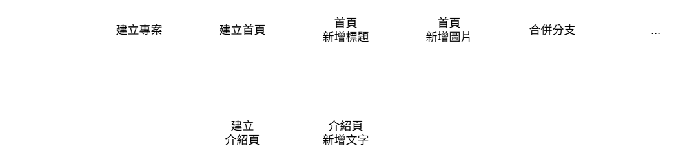
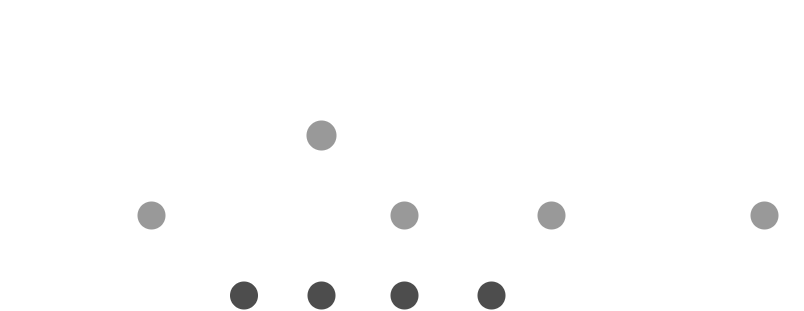

# 提交與分支
## 提交 (commit)

開發過程，等同 **一序列的功能新增和錯誤修正**。理想上開發會有 "階段"，將 **此次階段的變更"保存"到儲存庫的過程** ，就是 **提交 (commit)**。提供未來回復至當前 "階段"。
> git 每識別出一次變更，就可以進行一次 **提交**。因此 "階段" 的尺寸拿捏是主觀的，端看開發團隊共識。或者參考後續章節 [工作流程 (workflow)](https://github.com/Li732375/git_note/edit/main/note_2.md#%E5%B7%A5%E4%BD%9C%E6%B5%81%E7%A8%8B-workflow)。

> 每次提交紀錄，就是紀錄該次提交 "更新 / 變更後" 的專案狀態。

---

## 分支 (branch)

有時開發內容上彼此獨立，兩端同時進行，即並行方式開發。可以從原先 "主分支" 切出 **分支 (branch)**，各端獨立作業，未來再像拼圖一樣合併切出的分支內容。

假設要開發網站首頁與介紹頁，任務如下：
1. 建立首頁 > 新增標題 > 新增圖片
1. 建立介紹頁 > 新增文字

比較兩種開發序列：

|  | 原序列 | 分支序列 |
| :-: | :-: | :-: |
| 階段序列圖 |  |  |
| 分支序列圖 |  |  |

> 分支可以再區分
> - 長期分支：在專案開發中都會存在的分支，如主分支。
> - 短期分支：因應短期功能新增或錯誤修正而暫時延伸的分支，合併後就會刪除該分支。

---

## 工作流程 (workflow)

工作流程即透過規劃分支來進行協同開發，即分支策略，git 與 github 分別提供不同分支策略參考。

### git flow

採用五種分支進行開發：
| 分支名稱 | 說明 | 長 / 短期分支 |
| :-: | :- | :-: |
| main | 儲存釋出版本的程式碼，會加上標籤 (tag) 註記版本號。 | 長期分支 |
| develop | 與 main 分支同起點，儲存持續開發的程式碼，也就是即將釋出的程式碼。 | 長期分支 |
| feature | 開發新功能，自 develop 分出分支，完成後合併回 develop 分支。| 短期分支 |
| hotfix | 修復錯誤，自 main 分出分支，**完成後合併回 main 與 develop 分支。** | 短期分支 |
| release | 準備釋出程式碼，自 develop 分出分支，進行發布前最後的除錯與測試，**完成後合併回 main (釋出版本) 與 develop 分支。** | 短期分支 |

| gitflow 分支圖 |
| :-: |
|  |

### github flow

適用於被分配的分支開發下，再採用分支：
| 分支名稱 | 說明 | 長 / 短期分支 |
| :-: | :- | :-: |
| main | 儲存程式碼。 | 長期分支 |
| feature | 開發新功能，自 main 分出分支，完成後合併回 main 分支。| 短期分支 |
| hotfix | 修復錯誤，自 main 分出分支，完成後合併回 main 分支。 | 短期分支 |

| githubflow 分支圖 |
| :-: |
|  |

常見步驟

1. 當分配下的主分支 main 上開發完成，就會發起 **提取請求 (pull request)**，請求合併進遠端儲存庫的主分支。
2. 原開發者或團隊可以對此提交進行程式碼審查 (code review)，提出修改或建議討論。

    > 也概括合規、測試工作等等合併前確認作業。

3. 原開發者或團隊批准此提交後，進行 **合併 (merge)**。
4. 後續 github 就會進一步部屬至客戶端。
